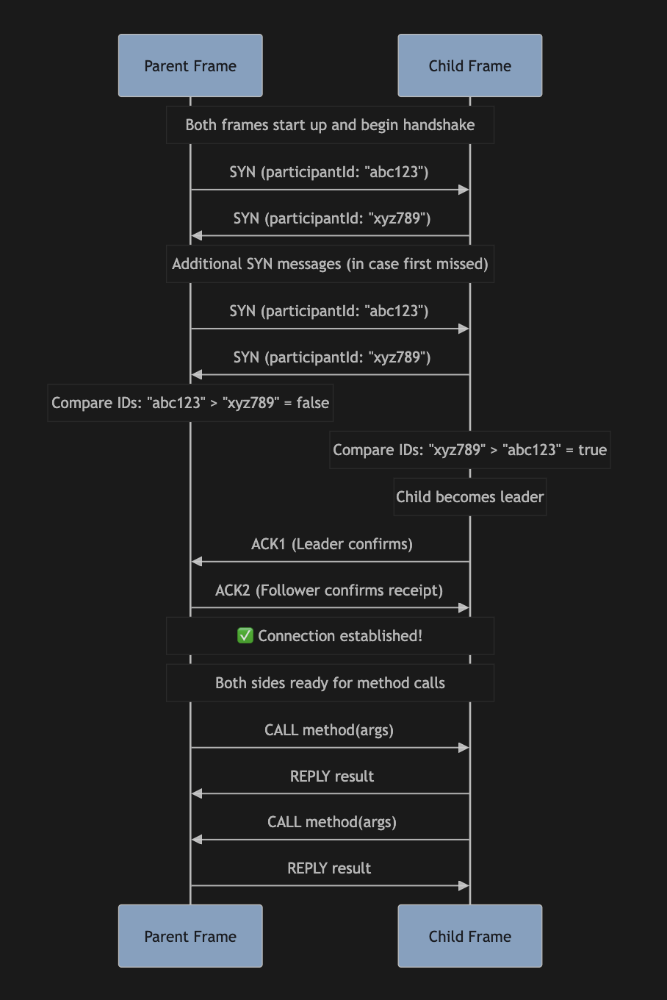

# Jotai Iframe Bridge

A robust iframe communication bridge with type-safe API and reactive state management using Jotai.

## Features

- **Type-safe communication** between parent and child iframes
- **Reactive state management** with Jotai atoms
- **Robust three-way handshake protocol** for reliable connection establishment
- **Automatic reconnection support** with `refresh()` method
- **Clean iframe lifecycle management** with `disconnect()` method
- **React hooks** for seamless integration
- **Bidirectional method calls** with Promise-based API
- **Unified bridge API** - same interface for both parent and child

## Three-Way Handshake Protocol

This library implements a sophisticated handshake protocol inspired by Penpal to ensure robust communication between parent and child frames. The protocol solves several challenges:

### Protocol Requirements

1. **Either participant can initiate** - Parent or child can start the handshake
2. **Handles timing issues** - One participant may not be ready when the other starts
3. **Avoids race conditions** - Both participants can send initial messages simultaneously
4. **Confirms bidirectional communication** - Both sides know the other is receiving messages
5. **Supports reconnection** - Either side can re-establish connection (e.g., iframe reload)

### Protocol Flow



### Protocol Details

#### 1. SYN Exchange
- Both participants send SYN messages containing their randomly generated participant IDs
- When receiving a SYN, each participant sends another SYN to ensure the other side received it
- This handles cases where one participant wasn't ready for the initial SYN

#### 2. Leadership Determination
- Both participants compare their IDs using lexicographical string comparison
- The participant with the lexicographically higher ID becomes the "handshake leader"
- This ensures exactly one participant will send ACK1, avoiding race conditions

#### 3. ACK1/ACK2 Exchange
- **Leader sends ACK1** to the follower
- **Follower receives ACK1** and responds with ACK2
- **Leader receives ACK2** and both sides establish the connection
- This confirms bidirectional communication is working

#### 4. Connection Establishment
- Both sides create remote proxies for method calls
- Connection promises resolve, making the bridge ready for use
- The connection is fully established and method calls can begin

### Example Logs

Here's what a successful handshake looks like in the logs:

```
🚌 Host Bridge: 📤 Sending message: SYN to origin: *
🚌 Child Bridge: 📤 Sending message: SYN to origin: *

🚌 Host Bridge: Received SYN message from participant: 93ym8wst9
🚌 Host Bridge: Leadership check: itmpknos1 > 93ym8wst9 = true
🚌 Host Bridge: 📤 Sending message: ACK1 to origin: http://localhost:5174

🚌 Child Bridge: Received ACK1 message, sending ACK2 response
🚌 Child Bridge: Connection established successfully (follower)

🚌 Host Bridge: Received ACK2 message, establishing connection
🚌 Host Bridge: Connection established successfully (leader)
```

## Basic Usage

### Parent (Host) Application

```tsx
import { createBridge, createBridgeProvider } from 'jotai-iframe-bridge'

// Define method interfaces
interface ParentMethods {
  add: (a: number, b: number) => Promise<number>
}

interface ChildMethods {
  subtract: (a: number, b: number) => Promise<number>
}


// Create bridge
const bridge = createBridge<ParentMethods, ChildMethods>({
  allowedOrigins: ['*'],
  methods: {
    add: async (a: number, b: number) => a + b
  },
  log: (...args: unknown[]) => console.log('🚌 Host Bridge:', ...args)
})

// Create provider and hooks
const { BridgeProvider, hooks } = createBridgeProvider<ParentMethods, ChildMethods>()
const { useBridge, useRemoteProxy } = hooks

function App() {
  return (
    <BridgeProvider bridge={bridge}>
      <MyComponent />
    </BridgeProvider>
  )
}

function MyComponent() {
  const bridge = useBridge()
  const remoteProxyLoadable = useRemoteProxy()
  const [iframeElement, setIframeElement] = useState<HTMLIFrameElement | null>(null)

  // Handle iframe connection
  useEffect(() => {
    if (!iframeElement?.contentWindow) return

    const contentWindow = iframeElement.contentWindow
    bridge.connect(contentWindow)

    return () => {
      // Clean disconnect on component unmount
      bridge.disconnect()
    }
  }, [bridge, iframeElement?.contentWindow])

  const callChildMethod = async () => {
    if (remoteProxyLoadable.state === 'hasData') {
      const result = await remoteProxyLoadable.data.subtract(10, 3)
      console.log('Result:', result) // 7
    }
  }

  const refreshConnection = () => {
    bridge.refresh() // Reconnect to same iframe
  }

  return (
    <div>
      <iframe ref={handleIframeRef} src="/child.html" />
      <button onClick={callChildMethod}>Call Child Method</button>
      <button onClick={refreshConnection}>🔄 Refresh Connection</button>
    </div>
  )
}
```

### Child (Iframe) Application

```tsx
import { createBridge, createBridgeProvider } from 'jotai-iframe-bridge'


// Create bridge
const bridge = createBridge<ChildMethods, ParentMethods>({
  allowedOrigins: ['*'],
  methods: {
    subtract: async (a: number, b: number) => a - b
  },
  log: (...args: unknown[]) => console.log('🚌 Child Bridge:', ...args)
})

// Create provider and hooks
const { BridgeProvider, hooks } = createBridgeProvider<ChildMethods, ParentMethods>()
const { useBridge, useRemoteProxy } = hooks

function App() {
  return (
    <BridgeProvider bridge={bridge}>
      <MyComponent />
    </BridgeProvider>
  )
}

function MyComponent() {
  const bridge = useBridge()
  const remoteProxyLoadable = useRemoteProxy()

  // Auto-connect to parent window
  useEffect(() => {
    bridge.connect() // Connects to parent window automatically
  }, [bridge])

  const callParentMethod = async () => {
    if (remoteProxyLoadable.state === 'hasData') {
      const result = await remoteProxyLoadable.data.add(5, 3)
      console.log('Result:', result) // 8
    }
  }

  return (
    <button onClick={callParentMethod}>Call Parent Method</button>
  )
}
```

## Bridge Lifecycle Management

### Connection Methods

```typescript
// Connect to a target window
bridge.connect(targetWindow?: Window)

// Check connection status
bridge.isConnected(): boolean

// Refresh connection (reconnect to same window)
bridge.refresh()

// Disconnect cleanly (for component unmount)
bridge.disconnect()

// Destroy bridge completely
bridge.destroy()
```

### Proper Iframe Lifecycle

```tsx
// ✅ Correct iframe lifecycle management
useEffect(() => {
  if (!iframeElement?.contentWindow) return

  bridge.connect(iframeElement.contentWindow)

  return () => {
    // Always disconnect on unmount to prevent memory leaks
    bridge.disconnect()
  }
}, [bridge, iframeElement?.contentWindow])

// ✅ Iframe refresh pattern
const refreshIframe = useCallback(() => {
  setIframeKey(prev => prev + 1) // Force remount
  setIframeElement(null) // Clear stale reference
}, [])

// Component that remounts on key change
<iframe
  key={iframeKey}
  ref={setIframeElement}
  src={REMOTE_URL}
/>
```

## API Reference

### Core Bridge API

#### `createBridge<TLocalMethods, TRemoteMethods>(config, store?)`

Creates a bridge for iframe communication (works for both parent and child).

**Parameters:**
- `config: ConnectionConfig<TLocalMethods>` - Bridge configuration
- `store?: Store` - Optional Jotai store

**Returns:** `Bridge<TLocalMethods, TRemoteMethods>`

**Bridge Interface:**
```typescript
interface Bridge<TLocalMethods, TRemoteMethods> {
  id: string
  connect(targetWindow?: Window): void
  isConnected(): boolean
  getRemoteProxyPromise(): Promise<RemoteProxy<TRemoteMethods>> | null
  getRemoteProxyAtom(): Atom<LazyLoadable<RemoteProxy<TRemoteMethods>>>
  refresh(): void      // Reconnect to same window
  disconnect(): void   // Clean disconnect
  destroy(): void      // Complete destruction
}
```

#### `createBridgeProvider<TLocalMethods, TRemoteMethods>()`

Creates React provider and hooks for Bridge.

**Returns:**
```tsx
{
  BridgeProvider: React.Component,
  hooks: {
    useBridge: () => Bridge<TLocalMethods, TRemoteMethods>,
    useRemoteProxy: () => LazyLoadable<RemoteProxy<TRemoteMethods>>
  }
}
```

### LazyLoadable State

The `useRemoteProxy` hook returns a `LazyLoadable` with these states:

```typescript
type LazyLoadable<T> =
  | { state: 'uninitialized' }
  | { state: 'loading' }
  | { state: 'hasData', data: T }
  | { state: 'hasError', error: Error }
```

**Usage:**
```tsx
const remoteProxy = useRemoteProxy()

switch (remoteProxy.state) {
  case 'uninitialized':
    return <div>Not connected</div>
  case 'loading':
    return <div>Connecting...</div>
  case 'hasData':
    // remoteProxy.data is fully typed RemoteProxy
    return <button onClick={() => remoteProxy.data.someMethod()}>Call Method</button>
  case 'hasError':
    return <div>Error: {remoteProxy.error.message}</div>
}
```

## Configuration

### `ConnectionConfig<TLocalMethods>`

```tsx
interface ConnectionConfig<TLocalMethods> {
  allowedOrigins?: (string | RegExp)[]  // Origins that can connect (default: [window.origin])
  methods?: TLocalMethods               // Methods to expose
  timeout?: number                      // Connection timeout (default: 10000ms)
  handshakeDelay?: number              // Artificial delay for testing (default: 0)
  log?: (...args: unknown[]) => void   // Custom logger
}
```

**Example:**
```tsx
const config = {
  allowedOrigins: ['*'], // Allow all origins (use specific origins in production)
  methods: {
    add: async (a: number, b: number) => a + b
  },
  timeout: 15000, // 15 second timeout
  log: (...args) => console.log('Bridge:', ...args)
}
```

## Advanced Usage

### Iframe Refresh Integration

```tsx
function IframeContainer() {
  const bridge = useBridge()
  const [iframeKey, setIframeKey] = useState(0)
  const [iframeElement, setIframeElement] = useState<HTMLIFrameElement | null>(null)

  // Connect when iframe loads
  useEffect(() => {
    if (!iframeElement?.contentWindow) return

    bridge.connect(iframeElement.contentWindow)

    return () => bridge.disconnect()
  }, [bridge, iframeElement?.contentWindow])

  const refreshIframe = () => {
    setIframeKey(prev => prev + 1) // Force iframe remount
    setIframeElement(null)         // Clear stale reference
  }

  return (
    <div>
      <button onClick={refreshIframe}>🔄 Refresh Iframe</button>
      <iframe
        key={iframeKey}
        ref={setIframeElement}
        src="http://localhost:5174"
      />
    </div>
  )
}
```

### Error Handling

```tsx
function ComponentWithErrorHandling() {
  const remoteProxy = useRemoteProxy()

  const callMethod = async () => {
    if (remoteProxy.state !== 'hasData') {
      console.log('Not connected yet')
      return
    }

    try {
      const result = await remoteProxy.data.riskyMethod()
      console.log('Success:', result)
    } catch (error) {
      console.error('Method call failed:', error)
    }
  }

  return <button onClick={callMethod}>Call Method</button>
}
```

## Why Three-Way Handshake?

The three-way handshake solves several critical issues that simpler protocols cannot handle:

### Problem with Two-Way Handshake

```
❌ Simple approach (doesn't work):
Parent: sends SYN → Child: sends ACK → Connection?
```

**Issues:**
- What if child isn't ready when parent sends SYN?
- What if both sides send SYN simultaneously?
- How do we handle iframe reloads?

### Problem with Both Sending ACK

```
❌ Race condition (our original issue):
Parent: sends SYN → receives SYN from child → sends ACK → waits for ACK
Child:  sends SYN → receives SYN from parent → sends ACK → waits for ACK
Result: Both waiting forever!
```

### Solution: Leadership + Confirmation

```
✅ Three-way handshake (reliable):
1. Both send SYN (either can initiate)
2. Leader determined by ID comparison (breaks tie)
3. Leader sends ACK1, follower responds with ACK2
4. Both sides confirm bidirectional communication
```

This protocol is battle-tested and handles all edge cases including:
- Race conditions during simultaneous connection attempts
- Iframe reloads and reconnection scenarios
- Timing issues where one side isn't ready
- Network reliability confirmation


